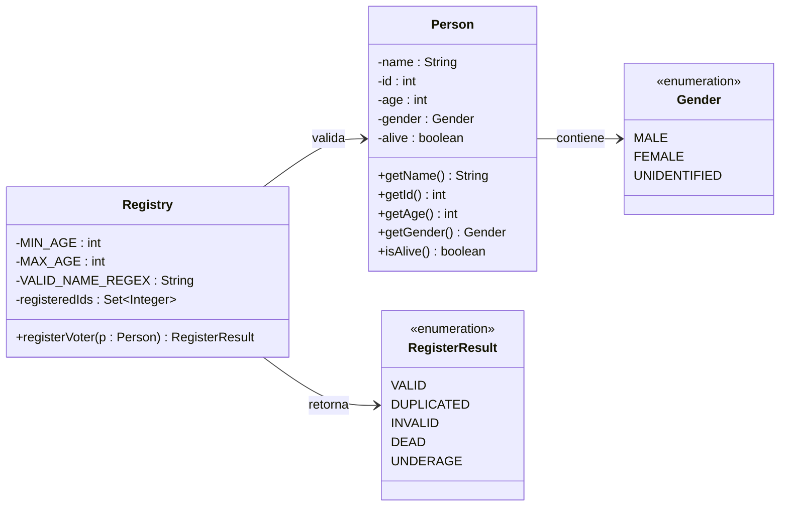

# Taller de Pruebas Unitarias - Registry Voter

## Inicio

### Resumen del dominio
Sistema de registro de votantes que valida si una persona puede ser registrada según reglas de negocio: edad, identidad, estado de vida, duplicados y seguridad en el nombre.

### Alcance del taller
- Aplicar TDD (Red → Green → Refactor)
- Diseñar clases de equivalencia y valores límite
- Escribir escenarios BDD (Given–When–Then)
- Medir cobertura con JaCoCo
- Documentar defectos encontrados

### Integrantes
Roberto Jose Breuer Rodriguez — Maestría en Ingeniería de Software, Unisabana.

---

## 🎨 Diagrama de Clases



---

## 🚀 Tecnologías


### Stack Tecnológico

| Tecnología | Versión | Propósito |
|------------|---------|-----------|
| Java | 17 | Lenguaje principal |
| Spring Boot | 4.0.6 | Framework base |
| Maven | 3.6+ | Gestión de dependencias y build |
| JUnit 5 | 6.0.3 | Framework de pruebas unitarias |
| JaCoCo | 0.8.8 | Cobertura de código |
| Checkstyle | 3.3.0 | Análisis estático (sun_checks) |
| Lombok | Latest | Reducción de boilerplate |

---

## TDD — Red → Green → Refactor

### Iteración 1: Validación de persona nula y muerta

**Red** — Se escribió el test antes de que existiera lógica:
```java
@Test
public void shouldReturnInvalidWhenPersonIsNull() {
    Assertions.assertEquals(RegisterResult.INVALID, registry.registerVoter(null));
}

@Test
public void shouldRejectDeadPerson() {
    Person dead = new Person("Carlos", 2, 40, Gender.MALE, false);
    Assertions.assertEquals(RegisterResult.DEAD, registry.registerVoter(dead));
}
```

**Green** — Implementación mínima en `Registry`:
```java
if (p == null) return RegisterResult.INVALID;
if (!p.isAlive()) return RegisterResult.DEAD;
return RegisterResult.VALID;
```

**Refactor** — Se extrajo la lógica a métodos con nombres claros y se agregaron constantes para los límites de edad.

---

### Iteración 2: Validación de edad (UNDERAGE e INVALID)

**Red** — Tests de valores límite:
```java
@Test
public void shouldRejectUnderageAt17() {
    Person minor = new Person("Luis", 3, 17, Gender.MALE, true);
    Assertions.assertEquals(RegisterResult.UNDERAGE, registry.registerVoter(minor));
}

@Test
public void shouldAcceptAdultAt18() {
    Person person = new Person("Sofia", 4, 18, Gender.FEMALE, true);
    Assertions.assertEquals(RegisterResult.VALID, registry.registerVoter(person));
}

@Test
public void shouldRejectInvalidAgeOver120() {
    Person person = new Person("Viejo", 7, 121, Gender.MALE, true);
    Assertions.assertEquals(RegisterResult.INVALID, registry.registerVoter(person));
}
```

**Green** — Se agregó `UNDERAGE` al enum `RegisterResult` y la validación en `Registry`:
```java
if (p.getAge() < MIN_AGE) return RegisterResult.UNDERAGE;
if (p.getAge() > MAX_AGE) return RegisterResult.INVALID;
```

**Refactor** — Se unificó la condición de edad en un solo bloque con distinción semántica entre `UNDERAGE` e `INVALID`.

---

### Iteración 3: Validación de ID y duplicados

**Red**:
```java
@Test
public void shouldRejectWhenIdIsZeroOrNegative() {
    Person p = new Person("Pedro", 0, 25, Gender.MALE, true);
    Assertions.assertEquals(RegisterResult.INVALID, registry.registerVoter(p));
}

@Test
public void shouldRejectDuplicatedVoter() {
    registry.registerVoter(new Person("Ana", 777, 25, Gender.FEMALE, true));
    Assertions.assertEquals(RegisterResult.DUPLICATED,
        registry.registerVoter(new Person("Ana", 777, 25, Gender.FEMALE, true)));
}
```

**Green** — Se agregó `Set<Integer> registeredIds` en `Registry`:
```java
if (p.getId() <= 0) return RegisterResult.INVALID;
if (!registeredIds.add(p.getId())) return RegisterResult.DUPLICATED;
```

**Refactor** — Se usó `HashSet` para O(1) en la detección de duplicados.

---

### Iteración 4: Seguridad en el nombre (SQL Injection)

**Red**:
```java
@Test
public void shouldRejectNameWithSqlInjection() {
    Person p = new Person("'; DROP TABLE voters;--", 15, 25, Gender.MALE, true);
    Assertions.assertEquals(RegisterResult.INVALID, registry.registerVoter(p));
}
```

**Green** — Se agregó validación con regex:
```java
private static final String VALID_NAME_REGEX =
    "^[a-zA-ZáéíóúÁÉÍÓÚñÑ ]+$";

if (!p.getName().matches(VALID_NAME_REGEX)) return RegisterResult.INVALID;
```

**Refactor** — Se separó la constante del regex para facilitar mantenimiento y se agregaron tests para nombre nulo, vacío y con solo espacios.

---

## Patrón AAA (Arrange–Act–Assert)

Todos los tests siguen el patrón AAA de forma implícita:

```java
@Test
public void shouldAcceptAdultAt18() {
    // Arrange
    Person person = new Person("Sofia", 4, 18, Gender.FEMALE, true);

    // Act
    RegisterResult result = registry.registerVoter(person);

    // Assert
    Assertions.assertEquals(RegisterResult.VALID, result);
}
```

**Pautas aplicadas:**
- Una sola responsabilidad por test
- Nombres descriptivos en formato `should[Comportamiento][Condición]`
- Sin lógica condicional dentro del test
- Instancia de `Registry` fresca por clase de test (campo `private final`)

---

## Clases de Equivalencia y Valores Límite

### Tabla de Clases de Equivalencia

| # | Clase | Condición | Entrada ejemplo | Resultado esperado |
|---|-------|-----------|-----------------|-------------------|
| CE1 | Válida | Persona viva, edad 18–120, id > 0, nombre válido | age=30, id=1, alive=true | `VALID` |
| CE2 | Inválida | Persona nula | `null` | `INVALID` |
| CE3 | Muerta | alive=false | alive=false | `DEAD` |
| CE4 | Menor de edad | age < 18 | age=17 | `UNDERAGE` |
| CE5 | ID inválido | id <= 0 | id=0, id=-5 | `INVALID` |
| CE6 | Duplicada | mismo id registrado dos veces | id=777 x2 | `DUPLICATED` |
| CE7 | Nombre nulo/vacío | null, "", "   " | name=null | `INVALID` |
| CE8 | Nombre con caracteres inválidos | números, símbolos, SQL | "Ana123", "@user!" | `INVALID` |

### Tabla de Valores Límite

| # | Campo | Valor límite | Resultado esperado | Justificación |
|---|-------|-------------|-------------------|---------------|
| VL1 | age | 17 | `UNDERAGE` | Un año bajo el mínimo |
| VL2 | age | 18 | `VALID` | Exactamente el mínimo permitido |
| VL3 | age | 19 | `VALID` | Un año sobre el mínimo |
| VL4 | age | 119 | `VALID` | Un año bajo el máximo |
| VL5 | age | 120 | `VALID` | Exactamente el máximo permitido |
| VL6 | age | 121 | `INVALID` | Un año sobre el máximo |
| VL7 | id | 0 | `INVALID` | Límite inferior inválido |
| VL8 | id | 1 | `VALID` | Mínimo id válido |

**Justificación de bordes:** Los límites 18 y 120 representan la edad mínima legal para votar y una edad máxima razonable para un ser humano. El id=0 se rechaza porque los identificadores deben ser positivos para garantizar unicidad real.

---

## BDD — Given–When–Then

### Escenario 1: Registro exitoso
```
Given una persona viva, con id=1, edad=30 y nombre "Ana"
When intento registrarla
Then el resultado debe ser VALID
```

### Escenario 2: Menor de edad
```
Given una persona viva, con id=3, edad=17 y nombre "Luis"
When intento registrarla
Then el resultado debe ser UNDERAGE
```

### Escenario 3: Persona duplicada
```
Given una persona con id=777 ya fue registrada exitosamente
When intento registrar otra persona con el mismo id=777
Then el resultado debe ser DUPLICATED
```

### Escenario 4: SQL Injection en nombre
```
Given una persona con nombre "'; DROP TABLE voters;--", id=15, edad=25
When intento registrarla
Then el resultado debe ser INVALID
```

### Escenario 5: Persona fallecida
```
Given una persona con alive=false, id=2, edad=40
When intento registrarla
Then el resultado debe ser DEAD
```

---

## Resultados

### Cobertura JaCoCo

Reporte generado en `target/site/jacoco/index.html` tras ejecutar:


```bash
mvn clean test
```

> ✅ Cobertura global: **94%** — supera el umbral mínimo del 80%.

### Líneas sin cubrir

| Paquete | Líneas no cubiertas | Razón |
|---------|--------------------|---------|
| `edu.unisabana.tyvs.tdd` | `PruebasunitariasApplication.main()` y constructor privado | Clase de arranque de Spring Boot. No se testea en pruebas unitarias de dominio puro. Es esperado y aceptado. |
| `edu.unisabana.tyvs.tdd.domain.model` | 1 línea en `Person` o enum | Getters o valores de enum no invocados directamente en los tests actuales. No afectan la lógica de negocio validada. |

### Resumen de ejecución

```
Tests run: 15, Failures: 0, Errors: 0, Skipped: 0
BUILD SUCCESS
```

### Conclusiones técnicas

- TDD forzó diseñar la API antes de implementarla, resultando en un `Registry` con responsabilidad única y sin dependencias externas.
- La separación semántica entre `UNDERAGE` e `INVALID` mejoró la expresividad del dominio y facilitó el manejo de errores en capas superiores.
- La validación de nombre con regex en la capa de dominio aplica **defense in depth**: el sistema no depende únicamente de la base de datos para prevenir SQL injection.
- El uso de `HashSet` para detección de duplicados garantiza O(1) en la búsqueda, lo que escala bien para grandes volúmenes de registros.
- Checkstyle con `sun_checks.xml` obligó a mantener Javadoc completo y código limpio desde el inicio.

---

## Gestión de Defectos

Ver archivo [`defectos.md`](defectos.md) para el registro completo de fallos encontrados y corregidos durante el taller.

---

## Reflexión Final

### ¿Qué escenarios no se cubrieron y por qué?

| Escenario | Razón |
|-----------|-------|
| `PruebasunitariasApplication.main()` | Es el punto de arranque de Spring Boot, no contiene lógica de negocio. Testearlo requeriría levantar el contexto completo, lo cual sale del alcance de pruebas unitarias de dominio puro. |
| Getter `getGender()` de `Person` | `Registry` no usa el género como criterio de validación, por lo que ningún test lo invoca directamente. |
| Valor `UNIDENTIFIED` de `Gender` | No existe una regla de negocio que lo rechace o acepte de forma diferente, por lo que no genera una rama de decisión en `Registry`. |
| Persistencia real de votantes | `Registry` usa un `HashSet` en memoria. No se cubrió el escenario de reinicio de la aplicación donde los IDs registrados se pierden, ya que requeriría una capa de persistencia fuera del dominio puro. |

### ¿Qué defectos reales detectaron los tests?

| Defecto | Detectado por |
|---------|---------------|
| `Registry` retornaba `VALID` para personas con `id = 0` o negativo | `shouldReturnInvalid_WhenIdIsZero` y `shouldReturnInvalid_WhenIdIsNegative` |
| No existía distinción entre menor de edad (`UNDERAGE`) e inválido (`INVALID`) | `shouldReturnUnderage_WhenAgeIs17` |
| Nombres con SQL injection eran aceptados como válidos | `shouldReturnInvalid_WhenNameContainsSqlInjection` |
| Nombres vacíos o con solo espacios eran aceptados | `shouldReturnInvalid_WhenNameIsEmpty` y `shouldReturnInvalid_WhenNameIsBlank` |
| Registrar el mismo votante dos veces retornaba `VALID` | `shouldReturnDuplicated_WhenVoterIsAlreadyRegistered` |

### ¿Cómo mejorarías la clase Registry para facilitar su prueba?

1. **Inyección de dependencias para el almacenamiento** — actualmente `Registry` instancia su propio `HashSet` internamente. Si se inyectara un repositorio por interfaz, sería posible usar un mock en los tests y desacoplar la lógica de validación del estado en memoria.

2. **Separar validaciones en métodos privados** — extraer cada regla (`isValidAge`, `isValidName`, `isValidId`) facilitaría identificar exactamente qué validación falló y haría el código más legible y mantenible.

3. **Usar un objeto `ValidationResult`** — en lugar de retornar directamente `RegisterResult`, un objeto intermedio podría acumular múltiples errores de validación, lo que permitiría tests más expresivos y mensajes de error más ricos para el cliente.

4. **Agregar `@Component` de Spring** — actualmente `Registry` es un POJO puro. Integrarlo al contexto de Spring con inyección del repositorio permitiría escalar hacia pruebas de integración sin cambiar la lógica de dominio.
